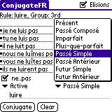

ConjugateFR
===========

A PalmOS program to conjugate french verbs.

I wrote this program while I was in high school. It was never perfect, but
it helped me learn conjugation, C, and event loops at the same time. It even got some decent reviews, in its day.

I wrote it using [OnBoardC](http://onboardc.sourceforge.net/) which was quite excellent for what it was, so
the source code is in PalmOS .pdb files; if you have something that can read AportisDoc, like say, [this](http://www.openoffice.org/xml/xmerge/plugins/aportisdoc.html),
you'll be able to open them.
Sorry about that, I'll see about porting them to plaintext Real Soon Now (though, then they won't compile proper anymore).
